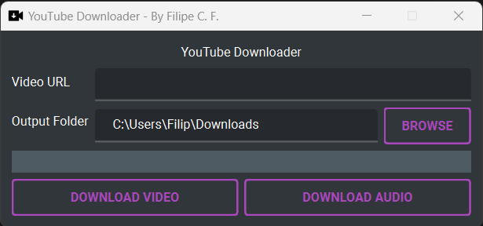

# YouTube Downloader

**A simple YouTube video and music downloader made with Python and Qt**



This project is a small YouTube video downloader made with Python and Qt. There's nothing much here, it's just a GUI for the **PyTube** and **MoviePy** packages.

Credits to [remix-icon](https://www.iconfinder.com/remix-icon) for the icon.

## Download

You can download a Windows executable of the YouTube Downloader here.

##Source Code


For those who want to create forks: the IDE used was **Qt Creator**, so I recommend that you use this same editor to modify the application.

### Dependencies

* Python 3
* [PySide6](https://pypi.org/project/PySide6/)
* [qt_material==2.14](https://pypi.org/project/qt-material/2.14/)
* [pytube==15.0.0](https://pypi.org/project/pytube/15.0.0)
* [moviepy==1.0.3](https://pypi.org/project/moviepy/1.0.3/)

### Generating executable

To generate a Windows executable, use the following command:

```sh
pyinstaller --onefile --windowed --icon=icons\ytd.ico main.py
```